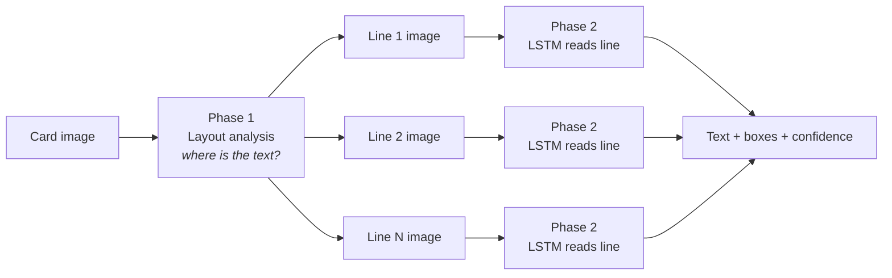
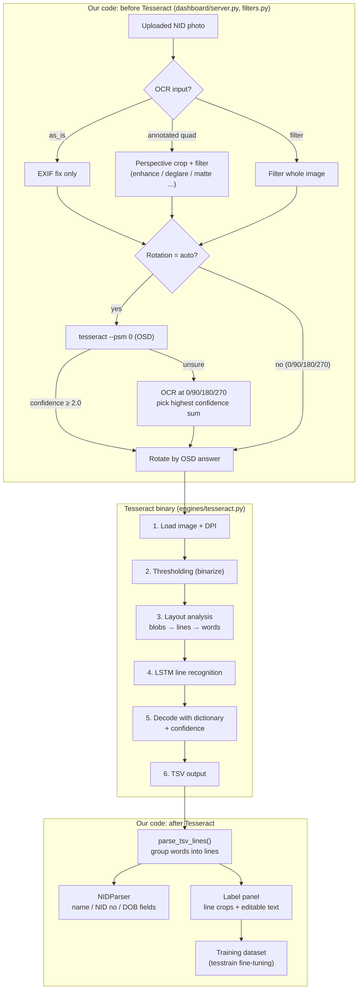
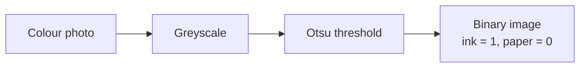
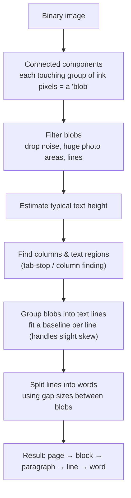
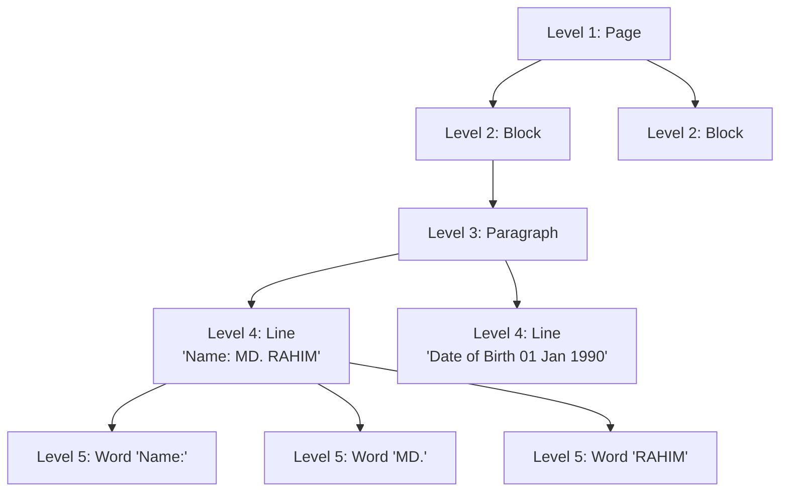
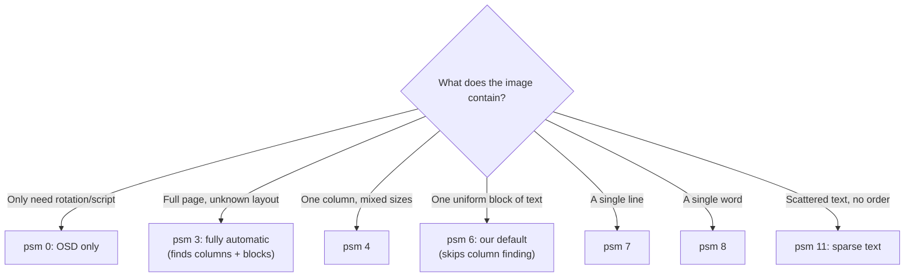
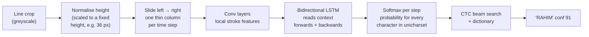
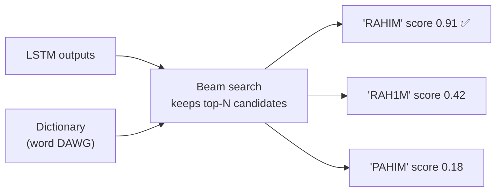
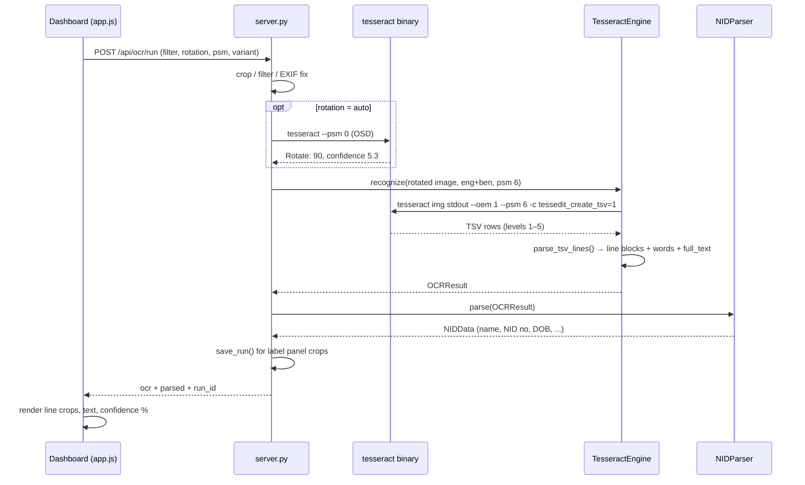
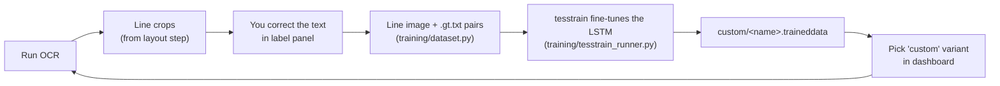

# How Tesseract Works

This doc explains what happens between clicking **Run OCR** in the dashboard and seeing
line crops with text and a confidence score. It covers two layers:

1. **Our pipeline**: what `nid_ocr_lab` does before and after calling Tesseract.
2. **Tesseract itself**: how the engine turns pixels into text.

Versions here: Tesseract **5.5.3** with Leptonica 1.87, run with `--oem 1` (LSTM only).
The default is `--psm 6`.

---

## 1. The short answer

You're right: **Tesseract does not read the whole image in one go.** It works in two
phases:

1. **Layout analysis** (no reading yet). Tesseract finds where the text is and cuts the
   image into **blocks → paragraphs → lines → words**.
2. **Recognition**. A neural network (an LSTM) reads **one text line at a time**, left to
   right, and outputs characters.

The "parts" you see in the dashboard are the **text lines** Tesseract found in phase 1.
Each one has the text the LSTM read from it in phase 2.



---

## 2. The full journey (dashboard → Tesseract → dashboard)



The rest of this doc walks through the Tesseract box, steps 1–6.

---

## 3. Step 1: Load the image and work out scale (DPI)

Tesseract has to know **how big the text is in pixels**, because its models were trained
on text of a certain size. Around **300 DPI** works best, where a capital letter is roughly
30 px tall.

We resolve DPI in `resolve_dpi()` ([tesseract.py](../nid_ocr_lab/engines/tesseract.py)), in this order:

| Order | Source | Result |
|---|---|---|
| 1 | `--dpi` passed explicitly | used as-is |
| 2 | DPI saved in the image (only if 70–1200) | passed as `--dpi` |
| 3 | Nothing | Tesseract estimates it from blob sizes (`Estimating resolution as N` in stderr) |

> **Why it matters:** if text is too small (for example a phone photo shrunk to 800 px
> wide), characters blur together and accuracy drops sharply. More pixels help up to a
> point, then only add time.

---

## 4. Step 2: Thresholding (turn the image black and white)

Layout analysis needs a clean **binary image**: every pixel is either ink or background.
Tesseract does this with **Otsu thresholding** by default, using Leptonica. Otsu picks the
grey level that best separates the dark and light pixels.



```
 Greyscale pixel values          After threshold (T = 128)
 ┌────────────────────┐          ┌────────────────────┐
 │ 230 220  40  35 210│          │  ·   ·   █   █   · │
 │ 225  50  45 215 220│   ──►    │  ·   █   █   ·   · │
 │ 218  42 205 212 228│          │  ·   █   ·   ·   · │
 └────────────────────┘          └────────────────────┘
```

**Weak spot for NID cards:** a single global threshold struggles with **glare, shadows and
the guilloche background pattern**. A bright glare patch can wipe out the text under it.
This is why our `deglare` / `matte` filters run *before* Tesseract. Tesseract 5 also
supports `-c thresholding_method=1` (adaptive Otsu) and `=2` (Sauvola), which set the
threshold locally instead of once for the whole image.

> The binary image drives **layout** (finding the lines). The LSTM recogniser reads from the
> **greyscale** version of each line, which keeps more detail than pure black and white.

---

## 5. Step 3: Layout analysis (dividing the image into parts)

This is the "divide into parts" step you noticed. No characters are recognised yet.

### 5.1 How the parts are found



The core idea is **connected components**: every separate spot of ink becomes a *blob*,
usually one character or part of one. Blobs of similar height that sit on a shared baseline
get chained into a **text line**.

```
  Blobs found on the image           Blobs chained into lines along a baseline
  ┌───────────────────────────┐      ┌───────────────────────────┐
  │ ▪ ▪▪ ▪ ▪   ▪▪ ▪           │      │[▪ ▪▪ ▪ ▪   ▪▪ ▪]  ← line 1│
  │                           │      │                           │
  │ ▪▪ ▪ ▪▪▪ ▪ ▪▪             │  ──► │[▪▪ ▪ ▪▪▪ ▪ ▪▪]    ← line 2│
  │                           │      │                           │
  │ ▪ ▪ ▪ ▪ ▪ ▪ ▪ ▪ ▪ ▪       │      │[▪ ▪ ▪ ▪ ▪ ▪ ▪ ▪ ▪ ▪]← line 3│
  └───────────────────────────┘      └───────────────────────────┘
```

> **Bengali note:** the *matra* (the horizontal headline, ━) joins the letters of a word into
> one big blob. Tesseract handles this at line level, which is one reason the LSTM reads
> whole lines instead of single characters.

### 5.2 The hierarchy (what the TSV "level" column means)



Every row of Tesseract's TSV output carries `page_num, block_num, par_num, line_num,
word_num`, a bounding box and a confidence. Our `parse_tsv_lines()` keeps only **level 5
(word)** rows, groups them by `(page, block, paragraph, line)`, and joins each line's word
boxes into one line box. **These line boxes are the crops in the label panel.**

### 5.3 PSM decides how much layout analysis runs

**PSM (Page Segmentation Mode)** tells Tesseract what kind of page to expect, so it can skip
parts of the layout analysis.



| PSM | Meaning | NID card fit |
|---|---|---|
| 0 | Orientation & script detection only | used by our `auto` rotation |
| 3 | Fully automatic layout (Tesseract's default) | can split the photo and text into odd blocks |
| 4 | Single column of variable-size text | often good for card fields |
| **6** | **Single uniform block** | **our default**: whole card = 1 block, lines still found |
| 7 | Single text line | good for **pre-cropped field** images |
| 8 | Single word | NID number crop |
| 11 | Sparse text, find as much as possible | cluttered backgrounds |

The dashboard's **sweep** strategy runs PSM `3, 4, 6, 11` and keeps the highest-scoring
result. That score is a heuristic, not measured accuracy.

---

## 6. Step 4: LSTM line recognition (the actual reading)

With `--oem 1`, every line image goes into an **LSTM neural network**. The pre-LSTM
"legacy" engine (`--oem 0`) matched character shapes one at a time; the `tessdata_fast` and
`tessdata_best` models we use don't include it.

### 6.1 What happens to one line



### 6.2 The sliding view, visually

The network doesn't cut the line into characters first. It sweeps across the line, and at
every small step it outputs a probability for each possible character, or for *blank*
(nothing new here).

```
 Line image:   ┃ R ┃ A ┃ H ┃ I ┃ M ┃
               ↓ ↓ ↓ ↓ ↓ ↓ ↓ ↓ ↓ ↓ ↓      (one arrow = one time step)

 Best char:    R R _ A A _ H _ I I M
               └┬┘   └┬┘   │   └┬┘ │
 CTC collapse:  R     A    H    I  M   → "RAHIM"
               (merge repeats, drop blanks "_")
```

This is **CTC (Connectionist Temporal Classification)** decoding:
- merge repeated characters that sit next to each other,
- remove the blank symbol.

This is why the LSTM copes with joined or touching letters, like Bengali conjuncts and
matra-connected words, better than a character-by-character engine.

### 6.3 Why "bidirectional" matters

A character is easier to read when you know its neighbours. The forward LSTM carries
context from the left and the backward LSTM from the right. For example, a smudged glyph
between `1 9` and `0` is much more likely to be a digit than the letter `O`.

### 6.4 Bengali specifics

- The model's **unicharset** lists every character or grapheme unit it can output.
- Bengali uses **recoding**: complex graphemes (consonant + vowel sign + hasanta
  combinations) are broken into smaller codes, so the network predicts short code
  sequences rather than thousands of separate conjunct classes.
- With `-l eng+ben` **both models run**, and Tesseract keeps whichever reading scores better
  for each word or line. Language order and choice affect both speed and accuracy.

---

## 7. Step 5: Dictionary, decoding and confidence

The beam search keeps several candidate readings at once (a "beam"). It scores them using:

- the **LSTM probabilities** for each character,
- **dictionary / word lists** (DAWGs packed inside `ben.traineddata` / `eng.traineddata`),
  which push candidates toward real words,
- character-class rules (digits next to digits, and so on).



> **NID caveat:** dictionaries help with ordinary words but can **hurt names and ID numbers**.
> A rare name may get "corrected" toward a common word. For number-only crops, a
> whitelist such as `-c tessedit_char_whitelist=0123456789` together with `--psm 7` is safer.

The **confidence** (0–100) in the TSV is derived from the winning path's probabilities. We
divide it by 100 per word. A line's confidence in the dashboard is the **average of its word
confidences**. Treat it as a rough signal, not a guarantee: a word can be wrong with 90%
confidence.

---

## 8. Step 6: Output

We ask for **TSV** (`-c tessedit_create_tsv=1`). One row per page, block, paragraph, line
and word:

```
level page_num block_num par_num line_num word_num left top width height conf  text
1     1        0         0       0        0        0    0   1200  760    -1
2     1        1         0       0        0        40   60  900   420    -1
4     1        1         1       1        0        40   60  620   38     -1
5     1        1         1       1        1        40   60  110   38     93.1  Name:
5     1        1         1       1        2        165  60  95    38     90.4  MD.
5     1        1         1       1        3        275  61  140   37     91.2  RAHIM
```

Our code then does the following:



---

## 9. What each knob changes

| Knob | Where | Affects step | Typical effect |
|---|---|---|---|
| Filter (`enhance`, `deglare`, …) | dashboard | 2 Thresholding | removes glare and background so blobs are clean |
| Perspective crop | dashboard | 3 Layout | straight, card-only image means fewer false blocks |
| Rotation (`auto` / OSD) | dashboard | 3 Layout | upside-down text produces garbage lines |
| `--dpi` / image size | engine | 1, 3, 4 | wrong scale: merged or split blobs, bad line height |
| `--psm` | dashboard | 3 Layout | how the image is divided into parts |
| `--oem 1` | engine | 4 | LSTM only |
| Variant `system` (fast) vs `best` | dashboard | 4 | `best` = bigger float model: slower, usually more accurate |
| `custom/<name>` | training | 4, 5 | model fine-tuned on our NID line crops |
| `-l eng+ben` | dashboard | 4, 5 | which models and dictionaries run |
| `OMP_THREAD_LIMIT` | engine | all | CPU threads per call (throughput tuning) |

---

## 10. How this connects to training

The line crops from Step 3 plus your corrected text become the training data:



Fine-tuning changes **only Step 4–5** (the LSTM weights and unicharset). It **does not**
change layout analysis. If lines are being split wrongly, fix that with preprocessing,
crop, rotation or PSM; training won't help.

---

## 11. Glossary

| Term | Meaning |
|---|---|
| **Blob** | A connected group of ink pixels; roughly one character or piece of one |
| **Baseline** | The imaginary line text sits on; used to group blobs into lines |
| **OSD** | Orientation & Script Detection (`--psm 0`) |
| **PSM** | Page Segmentation Mode: how the page is divided into parts |
| **OEM** | OCR Engine Mode: `0` legacy, `1` LSTM, `2` both, `3` default |
| **LSTM** | Long Short-Term Memory, a neural network that reads sequences with memory of context |
| **CTC** | Decoding that turns per-step predictions into a string (merge repeats, drop blanks) |
| **Unicharset** | The set of characters a model can output |
| **DAWG** | Compressed word list (dictionary) inside `.traineddata` |
| **traineddata** | Model file: LSTM weights, unicharset, dictionaries |
| **tessdata_fast / best** | Official model sets: fast = 8-bit integer, small; best = float, more accurate |
